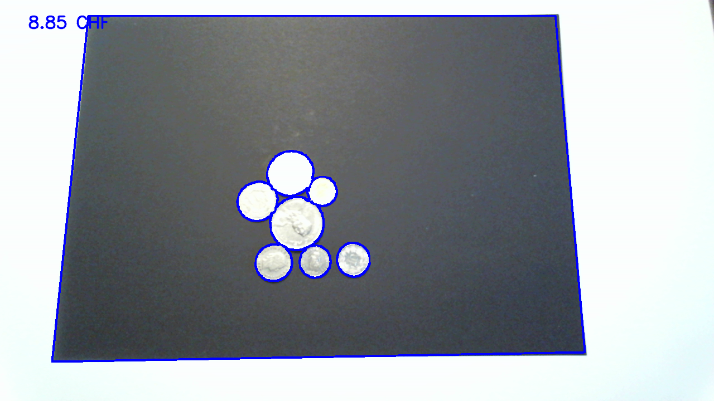
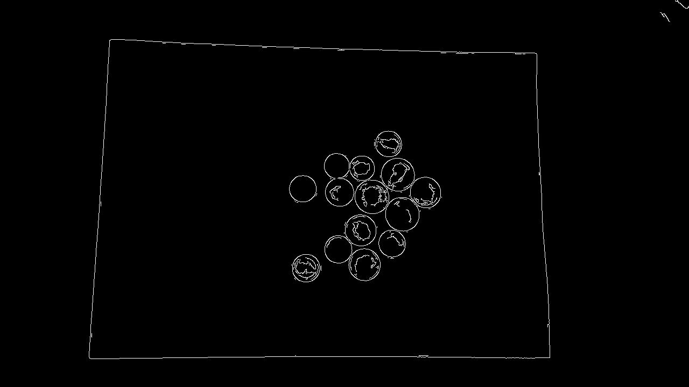
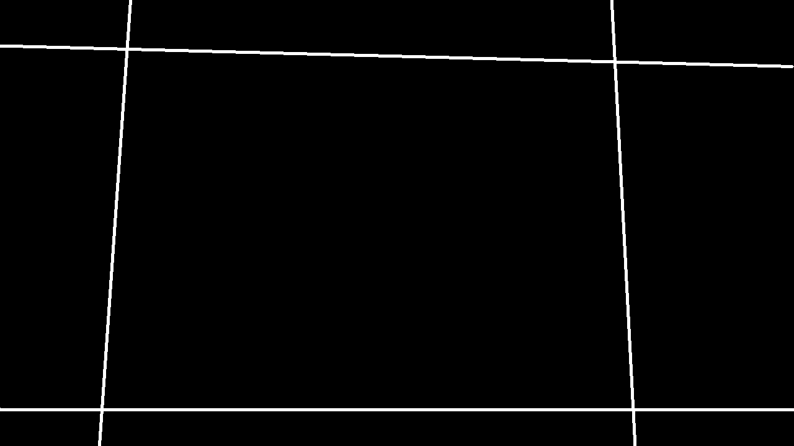
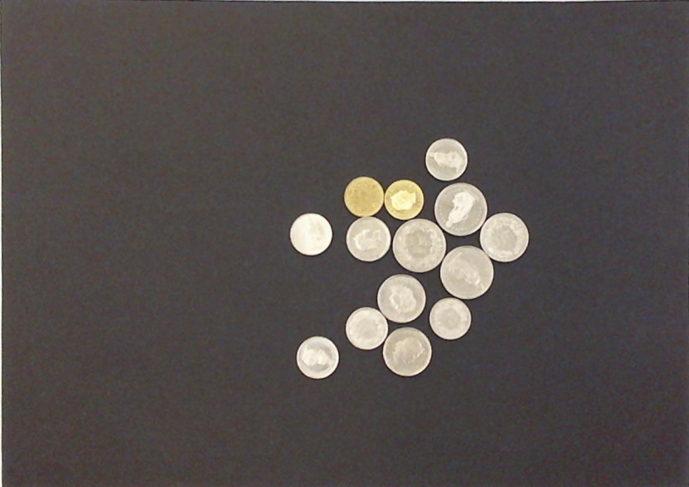
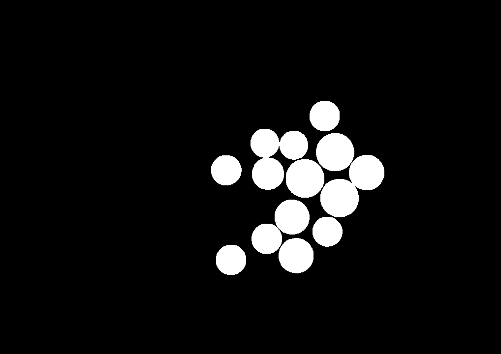
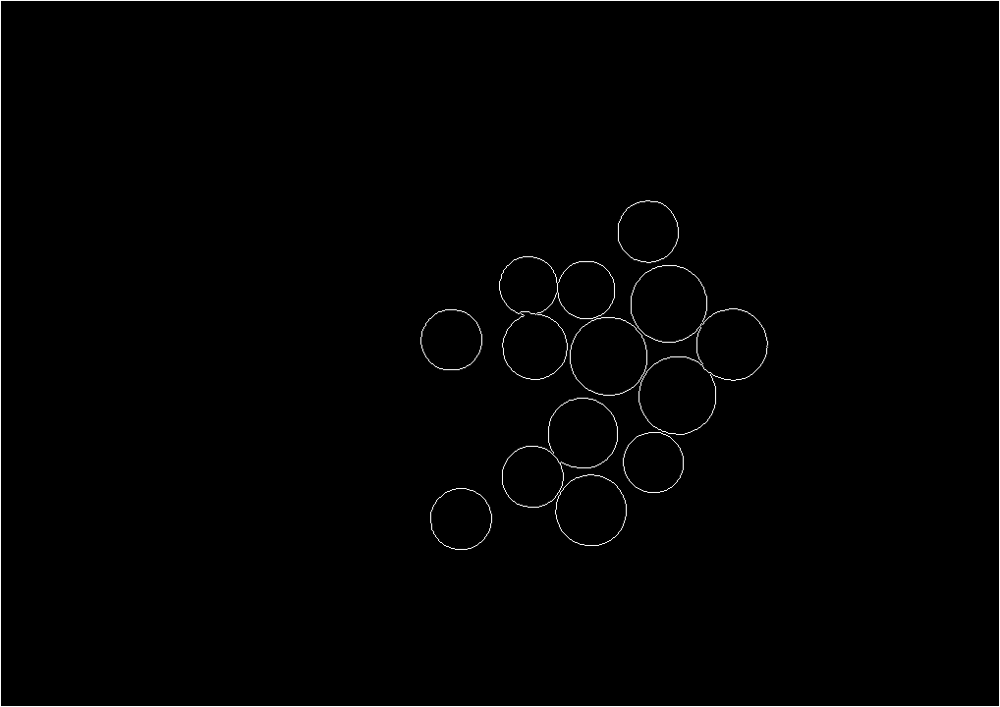
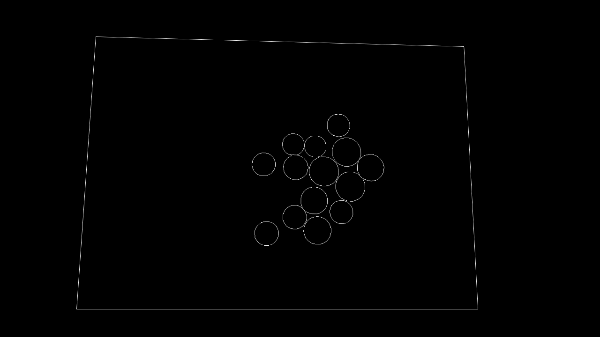
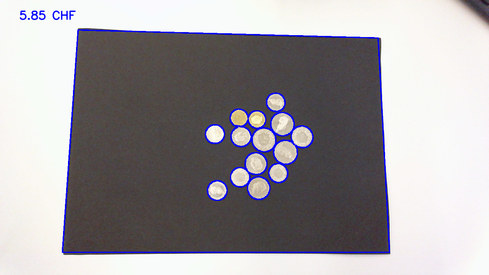

# coin-counter
This project counts the value of the coins on a sheet of paper. The project is configured to count swiss coins but can easily be adjusted for all coins as long as they're distinguishable by their surface area (with reasonable margins).

For this to work properly the following needs to be given:
1. The coins need to be placed on a black sheet of paper
2. The paper needs to be placed on a white surface
3. No further objects may be visible (cables etc.)
4. The coins may touch each other but the must not overlap

The program works by detecting the corners of the paper, transforming the perpective, segmenting the coins and then count them by approximating their surface area. The steps are described in more detail below.

## Running the program
Start the python script, by default it is configured to capture the image from an external camera on windows. If this setup doesn't match change the line `cap = cv.VideoCapture(1, cv.CAP_DSHOW)` to fit your setup.

While the program is running press `Q` to quit or `C` to capture the image and show the individual steps for the capture. The capture aswell as the different steps are stored as images in `./debug`.

## More detailed description of performed steps
## 1. Corner detection
Use canny edge detection to extract all edges:

Then use hough lines to detect the sides of the paper. There are many matches because the lines might not be perfectly straight. Use K-Means clustering to build four clusters (one for each side of the paper) and use the cluster average.

## 2. Homography transform
The perspective is changed using the intersections of the hough lines using `cv.warpPerspective(...)`:

## 3. Find the coins
First the image is thresholded and then potential gaps are closed by performing a morphological opening:

Then a distance transform followed by another thresholding is applied to get non-connected coins:

Then the markers are extracted using `cv.connectedComponents(...)` and then the regions are grown using the watershed algorithm and a mask is created that shows the coins:

The mask is than tranformed back again:

## 4. Count coins
The area of coins is then calculated by counting the pixels in each marker and the value is summed up. The mask is then overlayed of the original image captured from the webcam:

